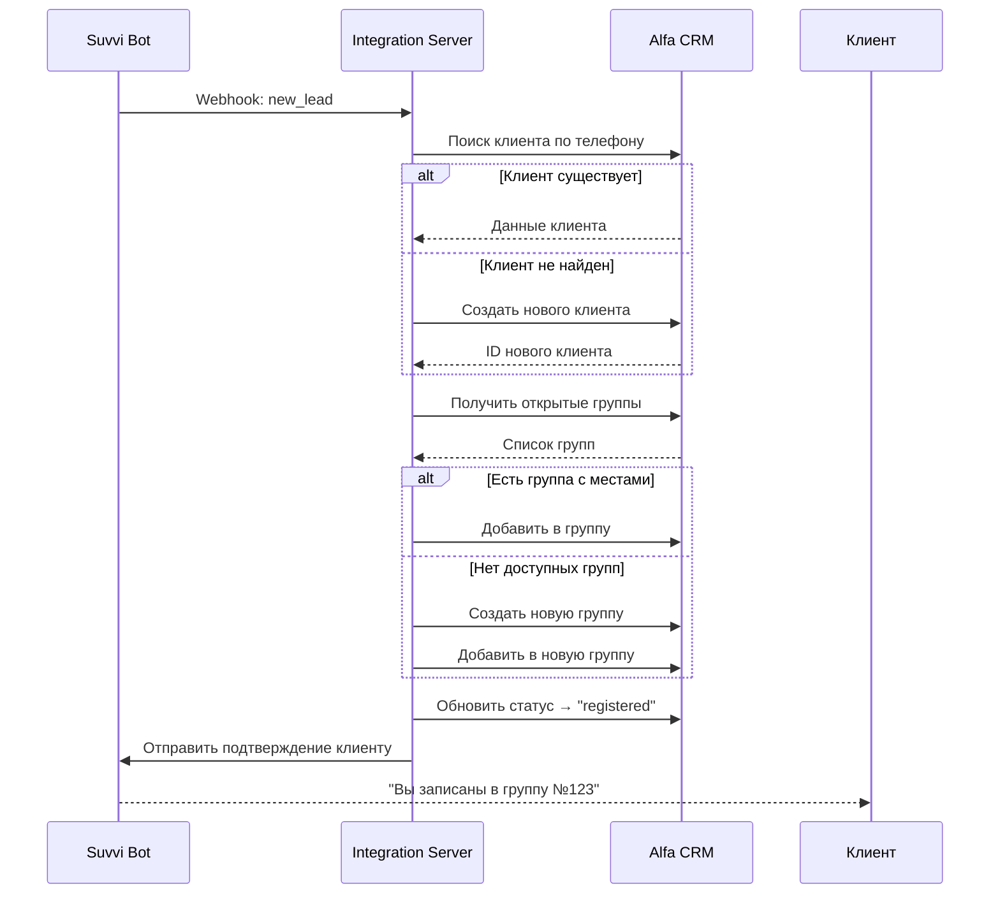

# 🤖 Suvvi ↔️ Alfa CRM Integration

Полнофункциональная интеграция чат-бота Suvvi с CRM системой Alfa CRM для автоматизации управления заявками, группами и студентами образовательного центра.

---

## 📋 Содержание

- [Возможности](#-возможности)
- [Архитектура системы](#-архитектура-системы)
- [Быстрый старт](#-быстрый-старт)
- [Настройка](#-настройка)
- [API документация](#-api-документация)
- [Бизнес-процессы](#-бизнес-процессы)
- [Автоматические задачи](#-автоматические-задачи)
- [Примеры использования](#-примеры-использования)
- [Устранение неполадок](#-устранение-неполадок)

---

## 🎯 Возможности

### ✅ Двусторонняя синхронизация в реальном времени
- **Из Suvvi в Alfa CRM**: Автоматическая передача новых заявок с созданием карточек клиентов
- **Из Alfa CRM в Suvvi**: Моментальное обновление статусов, оплат и событий в чат-боте
- **Webhook-based**: Мгновенная обработка событий без задержек

### 🎓 Умное управление группами
- **Автоформирование**: Автоматическое распределение студентов по группам до 8 человек
- **Динамическое создание**: Новые группы создаются автоматически при заполнении текущих
- **Контроль слотов**: API для проверки свободных мест в режиме реального времени
- **Гибкое управление**: Перенос студентов между группами с историей

### 👥 Полный жизненный цикл клиента
```
Новая заявка → Регистрация → Оплата → Обучение → Завершение
     ↓              ↓            ↓          ↓           ↓
   [new]      [registered]    [paid]   [active]   [completed]
```

### 🤖 Автоматизация коммуникаций
- **Напоминания**: За день до занятия (18:00)
- **Обратная связь**: Автоматический опрос после каждого урока
- **Оплаты**: Напоминания о неоплаченных записях (10:00)
- **Администрирование**: Уведомления о всех важных событиях
- **Аналитика**: Ежедневная сводка со статистикой (20:00)

---

## 🏗 Архитектура системы

```
┌─────────────┐         ┌──────────────────┐         ┌─────────────┐
│   Suvvi     │◄───────►│  Integration     │◄───────►│  Alfa CRM   │
│  Chat Bot   │ Webhooks│     Server       │ API     │    System   │
└─────────────┘         └──────────────────┘         └─────────────┘
                               │
                               │ Cron Jobs
                               ▼
                        ┌──────────────┐
                        │  Scheduled   │
                        │    Tasks     │
                        └──────────────┘
```

### 📂 Структура проекта

```
suvvi-alfa-integration/
├── 📄 index.js              # Главный сервер Express
├── 🔌 alfaApi.js           # Alfa CRM API + Webhook обработка
├── 💬 suvviApi.js          # Suvvi API + Webhook обработка
├── 👥 groupManager.js      # Логика управления группами
├── ⏰ reminder.js          # Планировщик задач (cron)
├── 📢 notifications.js     # Уведомления администратору
├── 📦 package.json         # Зависимости проекта
├── 🔐 .env                 # Переменные окружения (создать)
├── 📝 .env.example         # Шаблон переменных
├── 🚫 .gitignore          # Игнорируемые файлы
└── 📖 README.md           # Документация (этот файл)
```

---

## 🚀 Быстрый старт

### Требования
- Node.js >= 16.x
- npm >= 8.x
- Доступ к Alfa CRM API
- Доступ к Suvvi Bot API

### Установка

```bash
# 1. Клонировать репозиторий
git clone https://github.com/your-username/suvvi-alfa-integration.git
cd suvvi-alfa-integration

# 2. Установить зависимости
npm install

# 3. Создать файл конфигурации
cp .env.example .env

# 4. Отредактировать .env (см. раздел Настройка)
nano .env

# 5. Запустить сервер
npm start
```

Сервер запустится на `http://localhost:3000`

---

## ⚙️ Настройка

### 1. Создайте `.env` файл

```bash
# === Конфигурация сервера ===
PORT=3000
NODE_ENV=production

# === Alfa CRM API ===
ALFA_API_URL=https://your-school.s20.online/v2api/1
ALFA_API_KEY=your_alfa_crm_api_key_here

# === Suvvi API ===
SUVVI_API_URL=https://api.suvvi.io/v1
SUVVI_TOKEN=your_suvvi_token_here

# === Администратор ===
ADMIN_SUVVI_ID=admin_suvvi_user_id
```

### 2. Получите API ключи

#### Alfa CRM:
1. Войдите в админ-панель Alfa CRM
2. Перейдите в **Настройки** → **API**
3. Создайте новый API ключ
4. Скопируйте `API Key` в `.env` как `ALFA_API_KEY`
5. Скопируйте базовый URL (обычно `https://ваша-школа.s20.online/v2api/1`)

#### Suvvi:
1. Войдите в панель управления Suvvi
2. Перейдите в раздел **API & Webhooks**
3. Создайте новый токен
4. Скопируйте токен в `.env` как `SUVVI_TOKEN`

### 3. Настройте Webhooks

#### В Suvvi:
```
URL: https://your-server.com/webhook/suvvi
События:
  ✅ new_lead           (новая заявка)
  ✅ payment_confirmed  (подтверждение оплаты)
  ✅ feedback_received  (получен отзыв)
  ✅ cancellation       (отмена записи)
```

#### В Alfa CRM:
```
URL: https://your-server.com/webhook/alfa
События:
  ✅ student.status_changed  (изменение статуса)
  ✅ payment.created         (создана оплата)
  ✅ group.full              (группа заполнена)
  ✅ lesson.completed        (урок завершен)
```

---

## 📡 API документация

### Health Check

Проверка работоспособности сервера

```http
GET /health
```

**Ответ:**
```json
{
  "status": "OK",
  "timestamp": "2025-10-28T12:00:00.000Z",
  "uptime": 3600
}
```

### Получение свободных слотов

```http
GET /api/slots/:courseId
```

**Параметры:**
- `courseId` (path) - ID курса в Alfa CRM

**Пример запроса:**
```bash
curl http://localhost:3000/api/slots/456
```

**Ответ:**
```json
{
  "total_available": 12,
  "groups": [
    {
      "group_id": 123,
      "course_id": 456,
      "available": 4,
      "total": 8,
      "start_date": "2025-11-01",
      "schedule": "Пн, Ср, Пт 18:00"
    },
    {
      "group_id": 124,
      "course_id": 456,
      "available": 8,
      "total": 8,
      "start_date": "2025-11-15",
      "schedule": "Вт, Чт 19:00"
    }
  ]
}
```

### Webhook Endpoints

#### Suvvi Webhook
```http
POST /webhook/suvvi
Content-Type: application/json

{
  "event": "new_lead",
  "data": {
    "lead_id": "suvvi_user_123",
    "name": "Иван Иванов",
    "phone": "+998901234567",
    "email": "ivan@example.com",
    "course_id": 456
  }
}
```

#### Alfa CRM Webhook
```http
POST /webhook/alfa
Content-Type: application/json

{
  "event": "student.status_changed",
  "data": {
    "student_id": 789,
    "suvvi_id": "suvvi_user_123",
    "old_status": "registered",
    "new_status": "paid"
  }
}
```

---

## 🔄 Бизнес-процессы

### Процесс записи студента



### Статусы клиента

| Статус | Описание | Действия |
|--------|----------|----------|
| `new` | Новая заявка получена | Автоматически при создании |
| `registered` | Записан в группу | После добавления в группу |
| `paid` | Оплата получена | После подтверждения платежа |
| `active` | Проходит обучение | Автоматически после старта курса |
| `completed` | Завершил курс | После последнего занятия |
| `cancelled` | Отменил запись | По запросу клиента |
| `transferred` | Перенесен в другую группу | При переносе между группами |

### Логика формирования групп

```javascript
// Псевдокод
function assignToGroup(studentId, courseId) {
  // 1. Получить все открытые группы по курсу
  groups = getOpenGroups(courseId)
  
  // 2. Найти группу с местами (< 8 человек)
  targetGroup = groups.find(g => g.members_count < 8)
  
  // 3. Если нет - создать новую
  if (!targetGroup) {
    targetGroup = createGroup(courseId)
    notifyAdmin("Создана новая группа")
  }
  
  // 4. Добавить студента
  addToGroup(targetGroup.id, studentId)
  
  // 5. Проверить заполненность
  if (targetGroup.members_count >= 8) {
    notifyAdmin("Группа заполнена")
  }
  
  return targetGroup
}
```

---

## ⏰ Автоматические задачи

Система использует `node-cron` для запланированных задач:

| Время | Задача | Описание |
|-------|--------|----------|
| **10:00** | 💰 Проверка оплат | Напоминания студентам с неоплаченными записями |
| **18:00** | 🔔 Напоминания | Уведомления о занятиях на следующий день |
| **20:00** | 📊 Сводка | Дневная статистика администратору |

### Пример напоминания о занятии

```
📚 Напоминание о занятии!

🏫 Группа: Английский A1 (Группа №123)
📅 Завтра: среда, 29 октября 2025
⏰ Время: 18:00
📍 Место: Аудитория 201

До встречи! 👋
```

### Пример дневной сводки

```
📊 Сводка за день

📝 Новых заявок: 15
💰 Оплат: 12 (9,600,000 сум)
👥 Активных студентов: 156
📚 Открытых групп: 8
✅ Заполненных групп: 3
```

---

## 💡 Примеры использования

### Сценарий 1: Новый клиент записывается на курс

**Что происходит:**
1. Клиент заполняет форму в Suvvi боте
2. Suvvi отправляет webhook `new_lead` на сервер
3. Сервер создает клиента в Alfa CRM
4. Сервер находит/создает подходящую группу
5. Сервер добавляет клиента в группу
6. Клиент получает подтверждение с деталями группы

**Сообщение клиенту:**
```
✅ Вы записаны в группу №123!

📅 Занятия начнутся 1 ноября 2025
⏰ Время: Пн, Ср, Пт 18:00
👥 Мест в группе: 5/8

Для подтверждения участия необходимо внести оплату.
```

### Сценарий 2: Клиент вносит оплату

**Что происходит:**
1. Клиент оплачивает через Suvvi
2. Suvvi отправляет webhook `payment_confirmed`
3. Сервер регистрирует оплату в Alfa CRM
4. Статус клиента меняется на `paid`
5. Клиент получает подтверждение оплаты
6. Администратор получает уведомление

**Сообщение клиенту:**
```
✅ Оплата 800,000 сум успешно получена!

Теперь вы можете посещать занятия. 
Ждем вас на первом уроке 1 ноября!

До встречи! 👋
```

### Сценарий 3: После занятия собирается обратная связь

**Что происходит:**
1. Alfa CRM отмечает урок как завершенный
2. Alfa CRM отправляет webhook `lesson.completed`
3. Сервер отправляет запрос обратной связи всем студентам
4. Клиент видит интерактивные кнопки с оценками
5. После оценки клиент может оставить комментарий
6. Отзыв сохраняется в Alfa CRM

**Сообщение клиенту:**
```
Занятие завершено! 🎉

Пожалуйста, оцените урок от 1 до 5 и оставьте комментарий.

[⭐ 1] [⭐⭐ 2] [⭐⭐⭐ 3] [⭐⭐⭐⭐ 4] [⭐⭐⭐⭐⭐ 5]
```

---

## 🐛 Устранение неполадок

### Проблема: Сервер не запускается

**Решение:**
```bash
# Проверьте наличие .env файла
ls -la .env

# Проверьте синтаксис .env
cat .env

# Проверьте порт
lsof -i :3000  # если занят, измените PORT в .env
```

### Проблема: Webhooks не работают

**Проверьте:**
1. Сервер доступен из интернета (не localhost)
2. URL в настройках webhook правильный
3. HTTPS настроен (многие API требуют HTTPS)

**Тестирование webhook вручную:**
```bash
curl -X POST http://localhost:3000/webhook/suvvi \
  -H "Content-Type: application/json" \
  -d '{
    "event": "new_lead",
    "data": {
      "lead_id": "test_123",
      "name": "Test User",
      "phone": "+998901234567",
      "course_id": 456
    }
  }'
```

### Проблема: Студенты не получают сообщения

**Проверьте:**
1. `SUVVI_TOKEN` в .env правильный
2. `suvvi_id` клиента сохранен в Alfa CRM
3. Логи сервера: `console.log` покажет ошибки

### Проблема: Группы не создаются автоматически

**Проверьте:**
1. `ALFA_API_KEY` имеет права на создание групп
2. `course_id` существует в Alfa CRM
3. Логи: `❌ Ошибка создания группы:`

---

## 📊 Мониторинг и логирование

### Логи с эмодзи-префиксами

```
✅ Успешная операция
❌ Ошибка
📩 Получен webhook
🔔 Отправлено напоминание
✨ Создан новый ресурс
🔄 Синхронизация данных
💰 Операция с оплатой
📊 Статистика
⚠️  Предупреждение
```

### Пример логов

```
2025-10-28T12:00:00.000Z - POST /webhook/suvvi
📩 Webhook от Suvvi: new_lead
🔍 Поиск группы для студента 789, курс 456
✨ Новый клиент создан: Иван Иванов
✅ Студент 789 назначен в группу 123
📨 Уведомление отправлено администратору
✅ Заявка обработана: Иван Иванов → группа 123
```

---

## 🚀 Развертывание в production

### На VPS/VDS

```bash
# 1. Установите Node.js
curl -fsSL https://deb.nodesource.com/setup_18.x | sudo -E bash -
sudo apt-get install -y nodejs

# 2. Установите PM2 (менеджер процессов)
sudo npm install -g pm2

# 3. Клонируйте проект
git clone https://github.com/your-repo/suvvi-alfa-integration.git
cd suvvi-alfa-integration
npm install

# 4. Настройте .env
nano .env

# 5. Запустите с PM2
pm2 start index.js --name "suvvi-alfa"
pm2 save
pm2 startup

# 6. Настройте Nginx (опционально)
sudo nano /etc/nginx/sites-available/suvvi-alfa
```

### Nginx конфигурация

```nginx
server {
    listen 80;
    server_name your-domain.com;

    location / {
        proxy_pass http://localhost:3000;
        proxy_http_version 1.1;
        proxy_set_header Upgrade $http_upgrade;
        proxy_set_header Connection 'upgrade';
        proxy_set_header Host $host;
        proxy_cache_bypass $http_upgrade;
    }
}
```

### Docker (опционально)

```dockerfile
FROM node:18-alpine
WORKDIR /app
COPY package*.json ./
RUN npm install --production
COPY . .
EXPOSE 3000
CMD ["node", "index.js"]
```

```bash
docker build -t suvvi-alfa .
docker run -d -p 3000:3000 --env-file .env suvvi-alfa
```

---

## 🔐 Безопасность

### Рекомендации

1. **Никогда не коммитьте `.env`** файл в Git
2. **Используйте HTTPS** для webhook endpoints
3. **Валидируйте webhook подписи** (если API поддерживает)
4. **Ограничьте доступ** к серверу через firewall
5. **Регулярно обновляйте** зависимости: `npm audit fix`

### Проверка безопасности

```bash
# Аудит зависимостей
npm audit

# Автоматическое исправление
npm audit fix

# Проверка устаревших пакетов
npm outdated
```

---

## 📈 Производительность

### Оптимизация

```javascript
// В production рекомендуется добавить:
// 1. Rate limiting
import rateLimit from 'express-rate-limit';
const limiter = rateLimit({
  windowMs: 15 * 60 * 1000, // 15 минут
  max: 100 // лимит запросов
});
app.use('/webhook/', limiter);

// 2. Кэширование
// 3. Database connection pool
// 4. Clustering для многоядерных серверов
```

---

## 🤝 Поддержка

### Получить помощь

- 📧 Email: support@your-company.com
- 💬 Telegram: @your_support_bot
- 🐛 Issues: [GitHub Issues](https://github.com/your-repo/issues)

### Сообщить об ошибке

При создании issue укажите:
- Версию Node.js: `node -v`
- Описание проблемы
- Логи ошибок
- Шаги для воспроизведения

---

## 📝 Лицензия

ISC License - свободное использование для коммерческих и некоммерческих целей.
